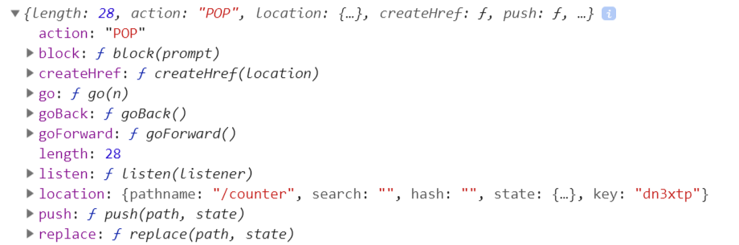

# history包


  ## 创建history对象

  根据你的环境，history包提供的3中不同的方法创建history对象
  createBrowserHistory
  createMemoryHistory  React Native
  createHashHistory 

```
const histort = createBrowserHistory({
  basename: '',
  forceRefresh: false, 
  keyLength: 6,
  getUserConfirmation: (message, callback) => callback(window.confirm(message))
});
```

## history 对象的属性与方法
以 createBrowserHistory 生成的hiatory对象为例

history.length  历史堆栈中的历史个数
history.location  当前location
history.action  The current navigation action
history.listen()
history.push(path, [state])
history.replace(path, [state])
history.go(n)
history.goBack()
history.goForward()
history.canGo(n)
history.block()
history.createHref()

其中listen事件的事件处理函数接受location和action作为参数
```
history.listen((location, action) => {
  console.log(
    `The current URL is ${location.pathname}${location.search}${location.hash}`
  );
  console.log(`The last navigation action was ${action}`);
});
```

当使用push或者replace方法时，可以传递一个 URL 和一个独立的

### location对象
```
{
  hash: ""
  key: "dn3xtp"
  pathname: "/counter"
  search: ""
  state：undefined
}
```

  ## action 参数 说明
  action is one of PUSH, REPLACE, or POP，取决于用户怎么怎么进入当前url
  history 对象的监听事件能监听到 history(history.push,pop,replace)编程式跳转事件以及浏览器前进后退的pop事件，
  不监听Link跳转


  https://www.npmjs.com/package/history
  https://github.com/ReactTraining/history